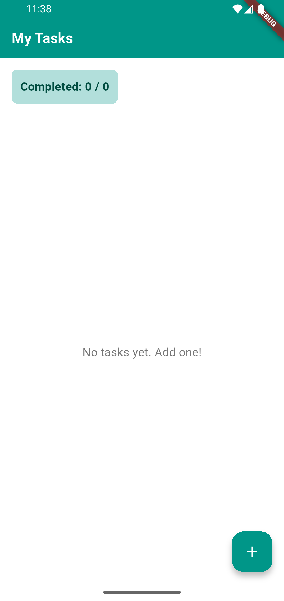
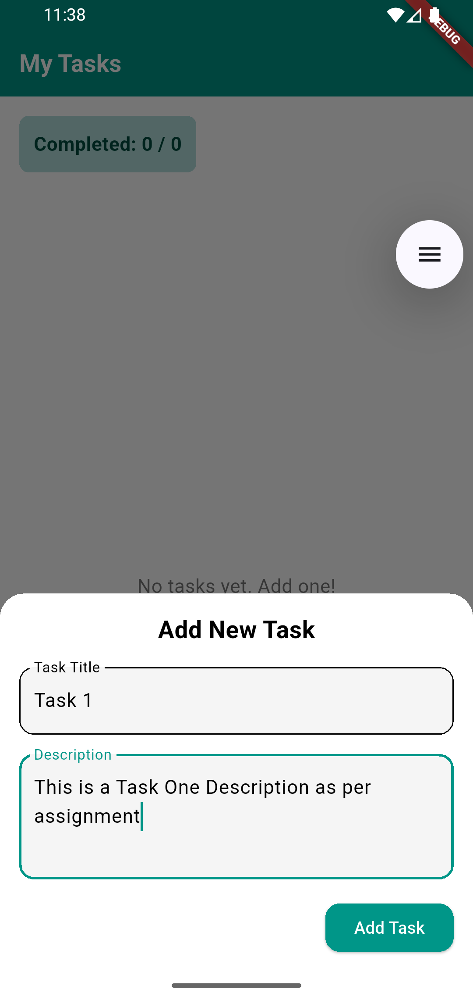
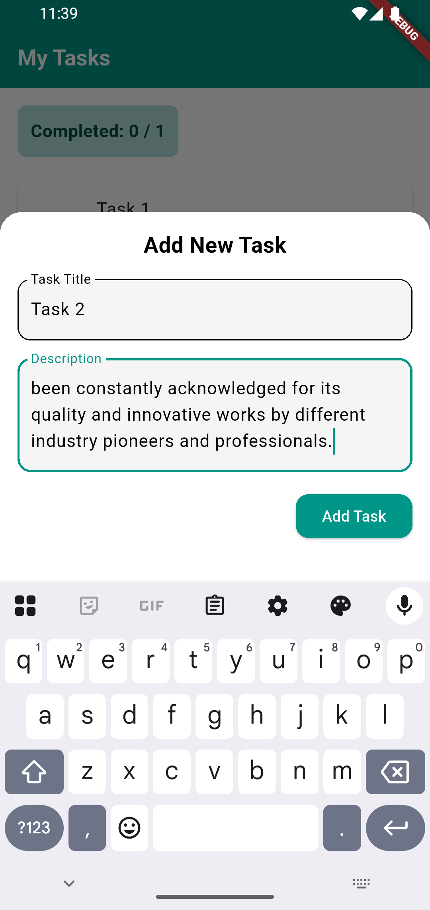
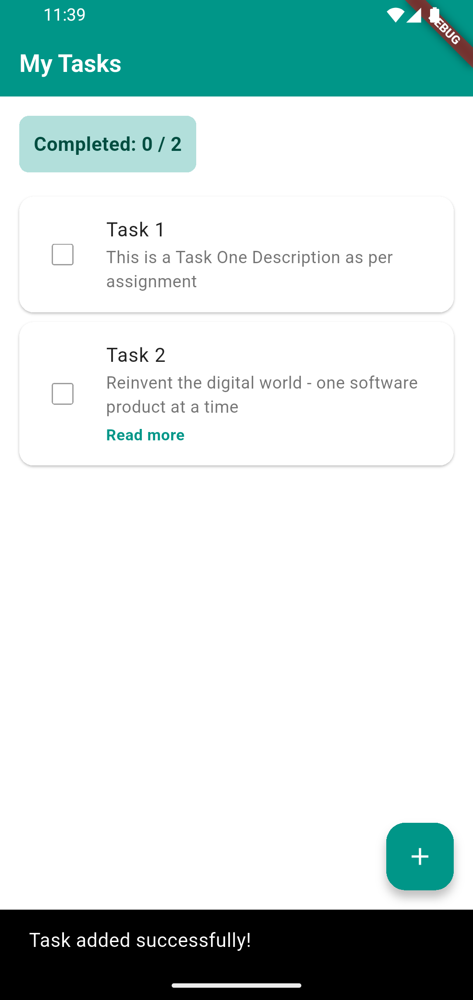
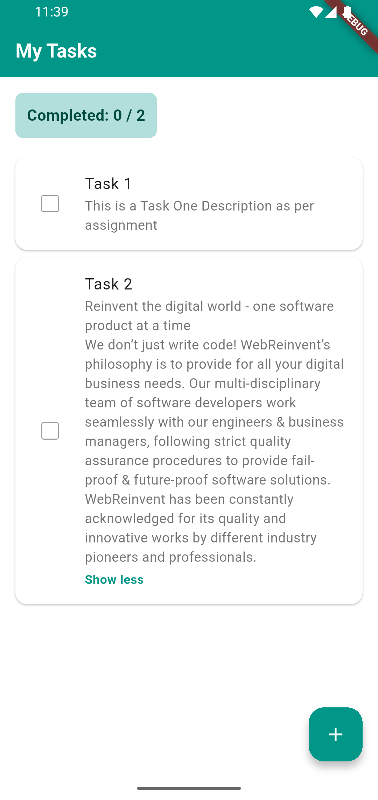
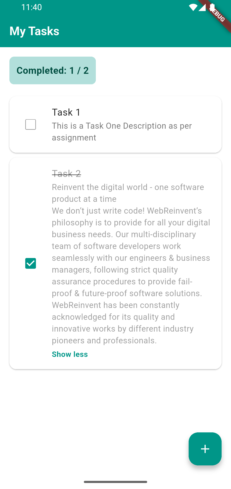
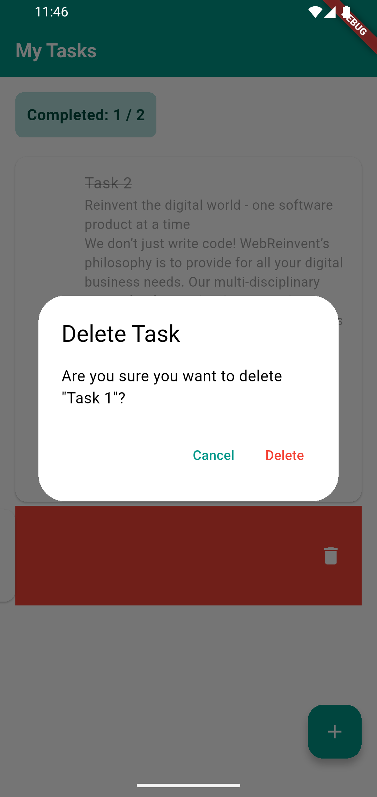
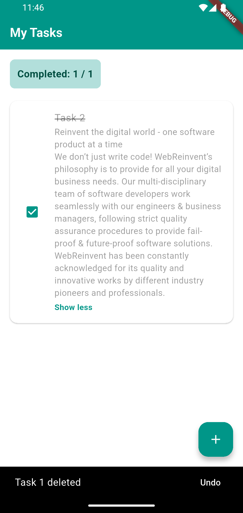

# ToDo Flutter Application

This is a simple ToDo application built using Flutter. The app allows users to add tasks, mark them as complete using a checkbox, and reorder the tasks. It follows **Clean Architecture** principles and uses **Provider** for state management.

## Features
- Add new tasks to the list
- Mark tasks as complete with a checkbox
- Reorder tasks in the list
- Add Dismissible widget to swipe right to dismiss/delete the task

## Tech Stack
- **Flutter**: Framework for building the mobile app
- **Dart**: Programming language for Flutter
- **Provider**: State management solution for the app
- **Clean Architecture**: Design pattern for maintaining separation of concerns

## Screenshots

<h2>Screenshots</h2>

  
  
  

   
  
  
   
  
  

